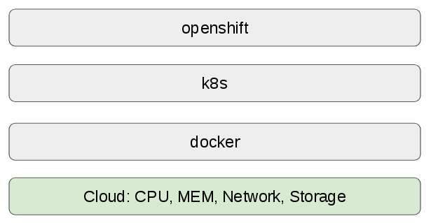

# Fading docker

## Original picture

So many features reply on docker and soon enough this became restrictions. As a result, this original picture looks like:

People want to see alternatives to docker while docker is still dominating containers world.
Here is a very informative slide from [Dan Walsh's presentation](https://primetime.bluejeans.com/a2m/events/playback/4a13ca22-53df-4fee-a61d-514331093d7b).

* image format: open container initiative (OCI)
* push/pull images: skopeo
* storage images locally: containers/storage
* execute images: OCI-runtime specification, eg, runc

## [System containers](system_container.md)

This is another way to run containers without docker. Even k8s is not in the picture. The name, system container, comes from the way (to achieve the goal that we want to make Atomic Host OS smaller) that some of the system services are shipped via container.

To run system containers, we need to have:

* container run-time: runc
* container storage: OSTree
* container image: skopeo

And _systemd_ is used for manager the services provided by system containers.

Keep the goal in mind that is to containerize system services, for example, atomic-openshift-node, atomic-openshift-master-api/controllers, etcd, openvswich. Those services can be also run as docker containers.

## [CRI-O](cri_o.md)

A docker implementation for k8s. Put it in another way, we can run k8s with cri-o without docker.

Its components:

* OCI compatible runtime, eg, runc
* container storage, eg, overlay2, devicemapper
* container image, a library supporting _skopeo_
* networking (CNI), eg, openshift-SND (using openvswitch), flannel
* container monitoring (conmon)
* security is provided by several core Linux capabilities

So docker is broken down into many things. Since cri-o is for k8s, some of the projects are actually from k8s, such as CNI and monitoring.
