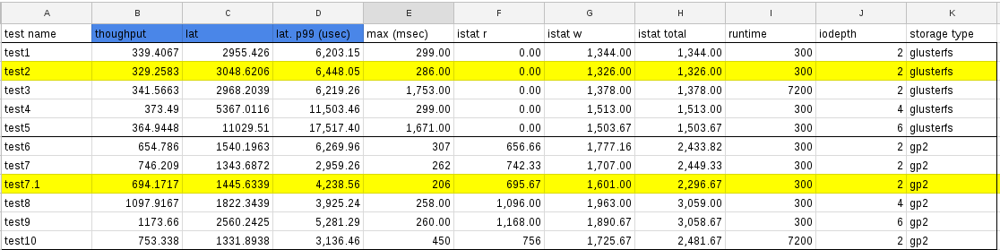

# Storage Test
This test is to run (via ssh) fio command in a CentOS pod on pbench remote node and send pbench-results to pbench server. 

## Doc
* [src](https://github.com/openshift/svt/tree/master/storage)
* [Siva's Demo](https://bluejeans.com/playback/s/BxX2fG6y4ZjAaii8JH1o7on8NfcZj2PV530lLKvyXyjPf3I5oOKQkizb939slYdT)
* [pbench-fio](https://github.com/distributed-system-analysis/pbench/blob/master/agent/bench-scripts/pbench-fio.md)
* [fio](../learn/fio.md)

## About the test

* The bash script <code>start-storage-test.sh</code> collects nodes in <code>config.yaml</code> and starts <code>storage-test.py</code>
* The python script <code>storage-test.py</code> sets up variables and starts the playbook <code>fio-test-setup.yaml</code>.
* <code>fio-test-setup.yaml</code>

  * Build a special docker image based on Dockerfile <code>fio/Dockerfile</code>
  * Create pod based on the above image
  * Run <code>pbench-fio</code> using the pod as client

See [storage_manual_steps.md](storage_manual_steps.md) for more details.

## EBS

### Run

```sh
# vi /etc/origin/master/master-config.yaml
...
projectConfig:
  defaultNodeSelector: ""
...

# systemctl restart atomic-openshift-master

# svt/storage
# #change the hosts in the cluster
# #nodes are compute nodes
# vi config.yaml
# scp id_rsa.pub to svt/storage/id_rsa.pub

# ./start-storage-test.sh
# OR,
# python storage-test.py fio --master ip-172-31-34-193.us-west-2.compute.internal --node ip-172-31-38-167.us-west-2.compute.internal
```

where _ip-172-31-34-193.us-west-2.compute.internal_ is the master node and _ip-172-31-38-167.us-west-2.compute.internal_ is the compute node where we want to run the pod on.

### Debug
Every test should run for a bout 2 - 3 mins.

```sh
# ll /var/lib/pbench-agent/fio_SEQ_IO_2017.08.29T13.11.11/
total 4
drwxr-xr-x. 5 root root  107 Aug 29 09:15 1-read-4KiB
drwxr-xr-x. 5 root root  107 Aug 29 09:17 2-read-128KiB
drwxr-xr-x. 5 root root  107 Aug 29 09:20 3-read-4096KiB
drwxr-xr-x. 5 root root  107 Aug 29 09:23 4-write-4KiB
drwxr-xr-x. 5 root root  107 Aug 29 09:25 5-write-128KiB
drwxr-xr-x. 5 root root  107 Aug 29 09:28 6-write-4096KiB
drwxr-xr-x. 3 root root   58 Aug 29 10:54 7-rw-4KiB
drwxr-xr-x. 3 root root   21 Aug 29 11:11 8-rw-128KiB
-rw-r--r--. 1 root root 1791 Aug 29 11:11 metadata.log
drwxr-xr-x. 3 root root   17 Aug 29 09:12 sysinfo
drwxr-xr-x. 2 root root    6 Aug 29 09:12 tmp

```

TODO: For the momemnt (OS 3.6), it takes much longer starting from <code>7-rw-4KiB</code>. It could be caused by pbench or the attached ebs-device.


Run <code>iostat</code> on the compute node,

```sh
# #on master
# oc get pvc -n fio-1 -o yaml | grep volumeName
    volumeName: pvc-6e737047-8cbb-11e7-9524-02389db2b36e
root@ip-172-31-34-193: ~/svt/storage # oc get pv pvc-6e737047-8cbb-11e7-9524-02389db2b36e -o yaml | grep volumeID
    volumeID: aws://us-west-2b/vol-0aaebf62041a345a1

# #on the computing node
# df -h | grep vol-0aaebf62041a345a1
/dev/xvdbq      9.8G  1.1G  8.2G  12% /var/lib/origin/openshift.local.volumes/plugins/kubernetes.io/aws-ebs/mounts/aws/us-west-2b/vol-0aaebf62041a345a1

# iostat -t 10 /dev/xvdbq
Linux 3.10.0-693.el7.x86_64 (ip-172-31-38-167.us-west-2.compute.internal) 	08/29/2017 	_x86_64_	(4 CPU)

08/29/2017 11:38:30 AM
avg-cpu:  %user   %nice %system %iowait  %steal   %idle
           1.31    0.00    1.78    2.05    0.09   94.77

Device:            tps    kB_read/s    kB_wrtn/s    kB_read    kB_wrtn
xvdbq            35.33      1443.25      3036.10   17830020   37508081

```

Or run it inside the container

```sh
# oc get pod -n fio-1 
NAME          READY     STATUS    RESTARTS   AGE
fio-1-c8p83   1/1       Running   0          2h

# oc volumes pod fio-1-c8p83 -n fio-1 
pods/fio-1-c8p83
  pvc/fio (allocated 10GiB) as fio-data
    mounted at /var/lib/fio

# oc rsh fio-1-c8p83
sh-4.2# df -h | grep fio
/dev/xvdbq                                                                                         9.8G  1.1G  8.2G  12% /var/lib/fio

sh-4.2# iostat -t 10  /dev/xvdbq  
Linux 3.10.0-693.el7.x86_64 (fio-1-c8p83) 	08/29/17 	_x86_64_	(4 CPU)

08/29/17 15:43:40
avg-cpu:  %user   %nice %system %iowait  %steal   %idle
           1.29    0.00    1.74    2.00    0.08   94.88

Device:            tps    kB_read/s    kB_wrtn/s    kB_read    kB_wrtn
xvdbq            34.46      1407.97      2961.87   17830020   37508081
```


### Check pbench results
check pbench results: [example](http://pbench.perf.lab.eng.bos.redhat.com/results/EC2::ip-172-31-24-235/). Compare to Siva's [results for OS 3.5](http://perf-infra.ec2.breakage.org/pbench/results/ip-172-31-14-88/).


### Manual clean-up
If some error happens, we want to rerun the test:

```sh
# oc delete project fio-1
# oc delete scc fio
# #might also need to kill pbench processes manually including pbench remote nodes
# ps -ef | grep fio | grep pbench | awk '{print $2}' | xargs kill -9
```

## GlusterFS

### Modify pod template
Moidy <code>content/fio-pod-pv.json</code> to use the storage class which represents glusterFS. _Note_ that it is not supported for the moment to run 2 fio tests with the same gluster.

### iostat

<code>iostat</code> command is trickier for glusterFS: It is not easy to tell which volume/device is the target.
This workaround might or might not he helpful:

On master: 10 pv as expected:

```sh
# oc get pv
NAME                                       CAPACITY   ACCESSMODES   RECLAIMPOLICY   STATUS    CLAIM       STORAGECLASS        REASON    AGE
pvc-e9cbba07-8ceb-11e7-9524-02389db2b36e   10Gi       RWO           Delete          Bound     fio-1/fio   glusterfs-storage             54m

```

On the compute node:

```sh
# dmsetup ls | grep brick
vg_1ac8a03843d4533d13c75f98649fe2c1-brick_1b68251da2a4c23afada88be77027317	(253:14)
vg_1ac8a03843d4533d13c75f98649fe2c1-brick_b625216d682febee41dbdafab4e9b4bd	(253:11)
```
This tells us that target is either 14 or 11.

```sh
# lsblk | grep brick
│   └─vg_1ac8a03843d4533d13c75f98649fe2c1-brick_1b68251da2a4c23afada88be77027317              253:14   0  10G  0 lvm  
│   └─vg_1ac8a03843d4533d13c75f98649fe2c1-brick_1b68251da2a4c23afada88be77027317              253:14   0  10G  0 lvm  
│   └─vg_1ac8a03843d4533d13c75f98649fe2c1-brick_b625216d682febee41dbdafab4e9b4bd              253:11   0   2G  0 lvm  
    └─vg_1ac8a03843d4533d13c75f98649fe2c1-brick_b625216d682febee41dbdafab4e9b4bd              253:11   0   2G  0 lvm 
```

Then we know that our volume is 10g, so number 14 is our target:

```sh
# iostat -t 10 dm-14
Linux 3.10.0-693.el7.x86_64 (ip-172-31-46-56.us-west-2.compute.internal) 	08/29/2017 	_x86_64_	(4 CPU)

08/29/2017 03:54:55 PM
avg-cpu:  %user   %nice %system %iowait  %steal   %idle
           1.00    0.00    1.22    1.55    0.09   96.15

Device:            tps    kB_read/s    kB_wrtn/s    kB_read    kB_wrtn
dm-14             4.92         0.17       792.94       4647   21995043

```

## pbench results

[example](http://pbench.perf.lab.eng.bos.redhat.com/results/EC2::ip-172-31-34-193/)


pbench data collection:

In case of glusterfs, 3 dedicated m2.4xlarge nodes for glusterfs and 1 m2.4xlarge node for heketi.

| date     | oc version                      | pbench version  | storage   | other info                               | link                                                                                                                                                                    |
|----------|---------------------------------|-----------------|-----------|------------------------------------------|-------------------------------------------------------------------------------------------------------------------------------------------------------------------------|
| 20170222 | 3.5                             | na              | ebs       |                                          | [server](http://pbench.perf.lab.eng.bos.redhat.com/results/EC2::ip-172-31-14-88/) and [ex-server](http://perf-infra.ec2.breakage.org/pbench/results/ip-172-31-14-88/)   |
| 20171005 | 3.7.0-0.126.4.git.0.3fc2b9b.el7 | 0.45-1g8874a17  | ebs       |                                          | [server](http://pbench.perf.lab.eng.bos.redhat.com/results/EC2::ip-172-31-53-207/) and [ex-server](http://perf-infra.ec2.breakage.org/pbench/results/ip-172-31-53-207/) |
| 20171016 | 3.7.0-0.153.0.git.0.88d9b46.el7 | 0.46-53g6327ec7 | glusterfs | glusterfs=3.2.0-7 <br /> heketi=3.2.0-11 | [server](http://pbench.perf.lab.eng.bos.redhat.com/results/EC2::ip-172-31-11-69/) and [ex-server](http://perf-infra.ec2.breakage.org/pbench/results/ip-172-31-11-69/)   |
| 20171122 | 3.7.9-1.git.0.7c71a2d.el7       | 0.46-78g30019c5 | ebs       |                                          | [server](http://pbench.perf.lab.eng.bos.redhat.com/results/EC2::ip-172-31-62-216/) and [ex-server](http://perf-infra.ec2.breakage.org/pbench/results/ip-172-31-62-216/) |
| 20171122 | 3.7.9-1.git.0.7c71a2d.el7       | 0.46-78g30019c5 | glusterfs |  glusterfs=3.3.0-362 <br /> heketi=3.3.0-362 <br /> block-p=3.3.0-362 | [server](http://pbench.perf.lab.eng.bos.redhat.com/results/EC2::ip-172-31-11-189/) and [ex-server](http://perf-infra.ec2.breakage.org/pbench/results/ip-172-31-11-189/) |
| 20171124 (15,16) | 3.7.9-1.git.0.7c71a2d.el7       | 0.46-78g30019c5 | glusterfs |  glusterfs=3.3.0-362 <br /> heketi=3.3.0-362 <br /> block-p=n/a | [server](http://pbench.perf.lab.eng.bos.redhat.com/results/EC2::ip-172-31-41-184/) and [ex-server](http://perf-infra.ec2.breakage.org/pbench/results/ip-172-31-41-184/) |
| 20171124 (18,19) | 3.7.9-1.git.0.7c71a2d.el7       | 0.46-78g30019c5 | glusterfs |  glusterfs=3.3.0-362 <br /> heketi=3.3.0-362 <br /> block-p=3.3.0-362 | [server](http://pbench.perf.lab.eng.bos.redhat.com/results/EC2::ip-172-31-41-184/) and [ex-server](http://perf-infra.ec2.breakage.org/pbench/results/ip-172-31-41-184/) |


## pbench-fio param tuning

oc: 3.7.9-1.git.0.7c71a2d.el7, pbench: 0.46-78g30019c5, glusterfs: 3.3.0-362

a1-a3: Cluster for gp2: 1 master, 1 infra, 1 compute: m4.xlarge

a4: Cluster for gp2: 1 master, 1 infra, 1 compute: m4.4xlarge

b1-b4: Cluster for glusterfs: 1 master, 1 infra: m4.xlarge; 5 compute: m4.4xlarge


| round | sc        | params                                                                                                                     | pbench data                                                                             |
|-------|-----------|----------------------------------------------------------------------------------------------------------------------------|-----------------------------------------------------------------------------------------|
| a1    | gp2       | sample=1, runtime=3600                                                                                                     | [ip-172-31-26-28](http://perf-infra.ec2.breakage.org/pbench/results/ip-172-31-26-28/)   |
| a2    | gp2       | sample=1, runtime=3600, ramp_time=300                                                                                      | [ip-172-31-30-91](http://perf-infra.ec2.breakage.org/pbench/results/ip-172-31-30-91/)   |
| a3    | gp2       | sample=1, runtime=3600, ramp_time=300                                                                                      |                                                                                         |
| a4    | gp2       | sample=1, runtime=3600, ramp_time=300,--block-sizes=4,16,64, --pre-iteration-script=/root/svt/storage/scripts/drop-cache.sh | [ip-172-31-63-239](http://perf-infra.ec2.breakage.org/pbench/results/ip-172-31-63-239/) |
| b1    | glusterfs | sample=1, runtime=3600                                                                                                     | [ip-172-31-26-171](http://perf-infra.ec2.breakage.org/pbench/results/ip-172-31-26-171/) |
| b2    | glusterfs | sample=1, runtime=3600, ramp_time=300                                                                                      | [ip-172-31-21-228](http://perf-infra.ec2.breakage.org/pbench/results/ip-172-31-21-228/) |
| b3    | glusterfs | sample=1, runtime=3600, ramp_time=300                                                                                      | [ip-172-31-6-247](http://perf-infra.ec2.breakage.org/pbench/results/ip-172-31-6-247/)   |
| b4    | glusterfs | sample=1, runtime=3600, ramp_time=300,--block-sizes=4,16,64, --pre-iteration-script=/root/svt/storage/scripts/drop-cache.sh | [ip-172-31-30-232](http://perf-infra.ec2.breakage.org/pbench/results/ip-172-31-30-232/) |

In order to keep [burst balance](http://docs.aws.amazon.com/AWSEC2/latest/UserGuide/EBSVolumeTypes.html), we use 1000G gp2 devices for glusterfs and for PVC used in the fio pod. We did it for a3 and b4.

### Observation

Based on the test so far:

* Stable results: If we execute the same test on different clusters, the results are very close to one another. Proof: a1 and a2, b1, b2, and b3.
* Before tuning (a0 vs b0), the result on glusterfs is worse (r) or not comparable (s). Our first try is to extend the test time from 30s to 3600s. This made the result more unpredictable: a1s is better while b1r is better. Notice that we got almost identical (r,w,rw) results on 4096K as block-size (Does it indicate that 4096 is not a good block-size number? No idea.). This try led to blaming burst balance. ^_^
* The 2nd try changed 2 things: bigger devices (1000G) to keep the burst balance. Smaller block size <code>bz=4,16,64</code>: 16K [is choson](http://docs.aws.amazon.com/AWSEC2/latest/UserGuide/EBSVolumeTypes.html) as benchmark in aws. 64K [is choson by Elko](http://pbench.perf.lab.eng.bos.redhat.com/results/gprfs013/fio_1_client_seq_2017.07.31T06.51.31/).
* Extending test time on glusterfs: b1 is slightly better than b0. Same as the bigger device and smaller block size: b4 is better than b3. We cannot say it is also the case for gp2 tests because a0 and a4 are not comparable. But it (a4) improves (a1) on random IO.
* It seems that we can correctly show the overhead of CNS: a4 is better than b4. Needs experts to confirm if any of these makes any sense.


### pbench-fio param tuning (part 2)
We use gp2 as [the type of ebs volume](http://docs.aws.amazon.com/AWSEC2/latest/UserGuide/EBSVolumeTypes.html) to create native PV and backup the storage for glusterfs.

* Fix params: --test-types=randrw --block-sizes=16
* Tuning: runtime=300 vs 7200; iodepth=2 vs 4 vs 6

#### Radom IO: glusterfs vs gp2





The following picture compares throughput, latency from pbench-fio, 99% latency from fio, IOPS from iostat of glusterfs and gp2 with iodepth=2 vs 4 vs 6, where
node3 is selected for iostat for glusterfs. Links to original pbench data are listed in the following sections.


Questions:
* max value of latency when runtime=7200: showed up after 1 hour for glusterfs and after 13 mins for gp2.
    How long should we wait? Or stable line on latency 99% is good enough?
* glusterfs did not used up all IO capacity from the backing up gp2 devices? How can we push it to the limit?
* pbench-fio result for [test7.1](http://perf-infra.ec2.breakage.org/pbench/results/ip-172-31-9-216/fio_gp2_RAND_IO_300s_2017.12.11T21.52.24/result.html),
 lat client is 1445.6339 and server is 725.2616. We have only 1 client? What is the formula on those 2 numbers?

#### Random IO: glusterfs
Nodes:

```sh
# oc get node --show-labels
NAME                                          STATUS                     AGE       VERSION             LABELS
ip-172-31-19-62.us-west-2.compute.internal    Ready                      2h        v1.7.6+a08f5eeb62   beta.kubernetes.io/arch=amd64,beta.kubernetes.io/instance-type=m4.4xlarge,beta.kubernetes.io/os=linux,failure-domain.beta.kubernetes.io/region=us-west-2,failure-domain.beta.kubernetes.io/zone=us-west-2b,glusterfs=storage-host,kubernetes.io/hostname=ip-172-31-19-62.us-west-2.compute.internal,region=primary,zone=default
ip-172-31-2-122.us-west-2.compute.internal    Ready                      2h        v1.7.6+a08f5eeb62   beta.kubernetes.io/arch=amd64,beta.kubernetes.io/instance-type=m4.4xlarge,beta.kubernetes.io/os=linux,failure-domain.beta.kubernetes.io/region=us-west-2,failure-domain.beta.kubernetes.io/zone=us-west-2b,glusterfs=storage-host,kubernetes.io/hostname=ip-172-31-2-122.us-west-2.compute.internal,region=primary,zone=default
ip-172-31-28-154.us-west-2.compute.internal   Ready                      2h        v1.7.6+a08f5eeb62   beta.kubernetes.io/arch=amd64,beta.kubernetes.io/instance-type=m4.4xlarge,beta.kubernetes.io/os=linux,failure-domain.beta.kubernetes.io/region=us-west-2,failure-domain.beta.kubernetes.io/zone=us-west-2b,glusterfs=storage-host,kubernetes.io/hostname=ip-172-31-28-154.us-west-2.compute.internal,region=primary,zone=default
ip-172-31-33-193.us-west-2.compute.internal   Ready                      2h        v1.7.6+a08f5eeb62   aaa=yyy,beta.kubernetes.io/arch=amd64,beta.kubernetes.io/instance-type=m4.4xlarge,beta.kubernetes.io/os=linux,failure-domain.beta.kubernetes.io/region=us-west-2,failure-domain.beta.kubernetes.io/zone=us-west-2b,kubernetes.io/hostname=ip-172-31-33-193.us-west-2.compute.internal,region=primary,zone=default
ip-172-31-48-195.us-west-2.compute.internal   Ready                      2h        v1.7.6+a08f5eeb62   aaa=ccc,beta.kubernetes.io/arch=amd64,beta.kubernetes.io/instance-type=m4.4xlarge,beta.kubernetes.io/os=linux,failure-domain.beta.kubernetes.io/region=us-west-2,failure-domain.beta.kubernetes.io/zone=us-west-2b,kubernetes.io/hostname=ip-172-31-48-195.us-west-2.compute.internal,region=primary,zone=default
ip-172-31-61-99.us-west-2.compute.internal    Ready                      2h        v1.7.6+a08f5eeb62   aaa=bbb,beta.kubernetes.io/arch=amd64,beta.kubernetes.io/instance-type=m4.4xlarge,beta.kubernetes.io/os=linux,failure-domain.beta.kubernetes.io/region=us-west-2,failure-domain.beta.kubernetes.io/zone=us-west-2b,kubernetes.io/hostname=ip-172-31-61-99.us-west-2.compute.internal,region=primary,zone=default
ip-172-31-7-100.us-west-2.compute.internal    Ready                      2h        v1.7.6+a08f5eeb62   beta.kubernetes.io/arch=amd64,beta.kubernetes.io/instance-type=m4.xlarge,beta.kubernetes.io/os=linux,failure-domain.beta.kubernetes.io/region=us-west-2,failure-domain.beta.kubernetes.io/zone=us-west-2b,kubernetes.io/hostname=ip-172-31-7-100.us-west-2.compute.internal,region=infra,zone=default
ip-172-31-9-216.us-west-2.compute.internal    Ready,SchedulingDisabled   2h        v1.7.6+a08f5eeb62   beta.kubernetes.io/arch=amd64,beta.kubernetes.io/instance-type=m4.xlarge,beta.kubernetes.io/os=linux,failure-domain.beta.kubernetes.io/region=us-west-2,failure-domain.beta.kubernetes.io/zone=us-west-2b,kubernetes.io/hostname=ip-172-31-9-216.us-west-2.compute.internal,region=infra,zone=default

```


```sh
# pbench-fio --test-types=randrw --clients=172.21.2.4 --config=RAND_IO_300s --samples=1 --max-stddev=20 --block-sizes=16 --job-file=config/random_io.job --pre-iteration-script=/root/svt/storage/scripts/drop-cache.sh
```

job file:

```
[global]
ioengine=libaio
iodepth=2
direct=1
sync=1
fsync_on_close=1
time_based=1
runtime=300
clocksource=clock_gettime
ramp_time=15
startdelay=5
filename=/var/lib/fio/test
size=5g
write_bw_log=fio
write_iops_log=fio
write_lat_log=fio
write_hist_log=fio
per_job_logs=1
log_avg_msec=1000
log_hist_msec=1000

[fio-1]
bs=16k
rw=randrw
numjobs=1
```

##### rumtime=300

[test1](http://perf-infra.ec2.breakage.org/pbench/results/ip-172-31-9-216/fio_RAND_IO_300s_2017.12.11T16.31.36/): throughput: 339.4067; lat: 2955.4260.
* Node MEM usage:
    * [node1](http://perf-infra.ec2.breakage.org/pbench/results/ip-172-31-9-216/fio_RAND_IO_300s_2017.12.11T16.31.36/1-randrw-16KiB/sample1/tools-default/FIO:ip-172-31-19-62.us-west-2.compute.internal/sar/memory.html)
    * [node2](http://perf-infra.ec2.breakage.org/pbench/results/ip-172-31-9-216/fio_RAND_IO_300s_2017.12.11T16.31.36/1-randrw-16KiB/sample1/tools-default/FIO:ip-172-31-2-122.us-west-2.compute.internal/sar/memory.html)
    * [node3](http://perf-infra.ec2.breakage.org/pbench/results/ip-172-31-9-216/fio_RAND_IO_300s_2017.12.11T16.31.36/1-randrw-16KiB/sample1/tools-default/FIO:ip-172-31-28-154.us-west-2.compute.internal/sar/memory.html)
* glusterfsd MEM usage:
    * [node1](http://perf-infra.ec2.breakage.org/pbench/results/ip-172-31-9-216/fio_RAND_IO_300s_2017.12.11T16.31.36/1-randrw-16KiB/sample1/tools-default/FIO:ip-172-31-19-62.us-west-2.compute.internal/pidstat/memory_usage.html)
    * [node2](http://perf-infra.ec2.breakage.org/pbench/results/ip-172-31-9-216/fio_RAND_IO_300s_2017.12.11T16.31.36/1-randrw-16KiB/sample1/tools-default/FIO:ip-172-31-2-122.us-west-2.compute.internal/pidstat/memory_usage.html)
    * [node3](http://perf-infra.ec2.breakage.org/pbench/results/ip-172-31-9-216/fio_RAND_IO_300s_2017.12.11T16.31.36/1-randrw-16KiB/sample1/tools-default/FIO:ip-172-31-28-154.us-west-2.compute.internal/pidstat/memory_usage.html)
* iostat on xvdf:
    * [node1](http://perf-infra.ec2.breakage.org/pbench/results/ip-172-31-9-216/fio_RAND_IO_300s_2017.12.11T16.31.36/1-randrw-16KiB/sample1/tools-default/FIO:ip-172-31-19-62.us-west-2.compute.internal/iostat/disk.html)
    * [node2](http://perf-infra.ec2.breakage.org/pbench/results/ip-172-31-9-216/fio_RAND_IO_300s_2017.12.11T16.31.36/1-randrw-16KiB/sample1/tools-default/FIO:ip-172-31-2-122.us-west-2.compute.internal/iostat/disk.html)
    * [node3](http://perf-infra.ec2.breakage.org/pbench/results/ip-172-31-9-216/fio_RAND_IO_300s_2017.12.11T16.31.36/1-randrw-16KiB/sample1/tools-default/FIO:ip-172-31-28-154.us-west-2.compute.internal/iostat/disk.html)
* hist.result: [client1](http://perf-infra.ec2.breakage.org/pbench/results/ip-172-31-9-216/fio_RAND_IO_300s_2017.12.11T16.31.36/1-randrw-16KiB/sample1/clients/172.21.2.4/hist/results.html)


[test2](http://perf-infra.ec2.breakage.org/pbench/results/ip-172-31-9-216/fio_RAND_IO_300s_2017.12.11T16.43.42/): throughput: 329.2583; lat: 3048.6206.
* Node MEM usage:
    * [node1](http://perf-infra.ec2.breakage.org/pbench/results/ip-172-31-9-216/fio_RAND_IO_300s_2017.12.11T16.43.42/1-randrw-16KiB/sample1/tools-default/FIO:ip-172-31-19-62.us-west-2.compute.internal/sar/memory.html)
    * [node2](http://perf-infra.ec2.breakage.org/pbench/results/ip-172-31-9-216/fio_RAND_IO_300s_2017.12.11T16.43.42/1-randrw-16KiB/sample1/tools-default/FIO:ip-172-31-2-122.us-west-2.compute.internal/sar/memory.html)
    * [node3](http://perf-infra.ec2.breakage.org/pbench/results/ip-172-31-9-216/fio_RAND_IO_300s_2017.12.11T16.43.42/1-randrw-16KiB/sample1/tools-default/FIO:ip-172-31-28-154.us-west-2.compute.internal/sar/memory.html)
* glusterfsd MEM usage:
    * [node1](http://perf-infra.ec2.breakage.org/pbench/results/ip-172-31-9-216/fio_RAND_IO_300s_2017.12.11T16.43.42/1-randrw-16KiB/sample1/tools-default/FIO:ip-172-31-19-62.us-west-2.compute.internal/pidstat/memory_usage.html)
    * [node2](http://perf-infra.ec2.breakage.org/pbench/results/ip-172-31-9-216/fio_RAND_IO_300s_2017.12.11T16.43.42/1-randrw-16KiB/sample1/tools-default/FIO:ip-172-31-2-122.us-west-2.compute.internal/pidstat/memory_usage.html)
    * [node3](http://perf-infra.ec2.breakage.org/pbench/results/ip-172-31-9-216/fio_RAND_IO_300s_2017.12.11T16.43.42/1-randrw-16KiB/sample1/tools-default/FIO:ip-172-31-28-154.us-west-2.compute.internal/pidstat/memory_usage.html)
* iostat on xvdf:
    * [node1](http://perf-infra.ec2.breakage.org/pbench/results/ip-172-31-9-216/fio_RAND_IO_300s_2017.12.11T16.43.42/1-randrw-16KiB/sample1/tools-default/FIO:ip-172-31-19-62.us-west-2.compute.internal/iostat/disk.html)
    * [node2](http://perf-infra.ec2.breakage.org/pbench/results/ip-172-31-9-216/fio_RAND_IO_300s_2017.12.11T16.43.42/1-randrw-16KiB/sample1/tools-default/FIO:ip-172-31-2-122.us-west-2.compute.internal/iostat/disk.html)
    * [node3](http://perf-infra.ec2.breakage.org/pbench/results/ip-172-31-9-216/fio_RAND_IO_300s_2017.12.11T16.43.42/1-randrw-16KiB/sample1/tools-default/FIO:ip-172-31-28-154.us-west-2.compute.internal/iostat/disk.html)
* hist.result: [client1](http://perf-infra.ec2.breakage.org/pbench/results/ip-172-31-9-216/fio_RAND_IO_300s_2017.12.11T16.43.42/1-randrw-16KiB/sample1/clients/172.21.2.4/hist/results.html)


Observation:
* MEM usage (node/glusterfsd) gets stable after 2 mins. More visible in stats from test1 while stable even from the beginning from test2.
* iostat on xdvf: gets stable after 2 mins from test1 while faster stable from test2. Read pressure happens only on one (node1) of the glusterfs node.
* 99% 6.3ms from test1 and 6.5ms from test2. The max does not seem stable enough (Noise?). Write pressure is doubled on one node (node3).

##### rumtime=7200

[test3](http://perf-infra.ec2.breakage.org/pbench/results/ip-172-31-9-216/fio_RAND_IO_7200s_2017.12.11T17.05.16/): throughput: 341.5663; lat: 2968.2039.
* Node MEM usage:
    * [node1](http://perf-infra.ec2.breakage.org/pbench/results/ip-172-31-9-216/fio_RAND_IO_7200s_2017.12.11T17.05.16/1-randrw-16KiB/sample1/tools-default/FIO:ip-172-31-19-62.us-west-2.compute.internal/sar/memory.html)
    * [node2](http://perf-infra.ec2.breakage.org/pbench/results/ip-172-31-9-216/fio_RAND_IO_7200s_2017.12.11T17.05.16/1-randrw-16KiB/sample1/tools-default/FIO:ip-172-31-2-122.us-west-2.compute.internal/sar/memory.html)
    * [node3](http://perf-infra.ec2.breakage.org/pbench/results/ip-172-31-9-216/fio_RAND_IO_7200s_2017.12.11T17.05.16/1-randrw-16KiB/sample1/tools-default/FIO:ip-172-31-28-154.us-west-2.compute.internal/sar/memory.html)
* glusterfsd MEM usage:
    * [node1](http://perf-infra.ec2.breakage.org/pbench/results/ip-172-31-9-216/fio_RAND_IO_7200s_2017.12.11T17.05.16/1-randrw-16KiB/sample1/tools-default/FIO:ip-172-31-19-62.us-west-2.compute.internal/pidstat/memory_usage.html)
    * [node2](http://perf-infra.ec2.breakage.org/pbench/results/ip-172-31-9-216/fio_RAND_IO_7200s_2017.12.11T17.05.16/1-randrw-16KiB/sample1/tools-default/FIO:ip-172-31-2-122.us-west-2.compute.internal/pidstat/memory_usage.html)
    * [node3](http://perf-infra.ec2.breakage.org/pbench/results/ip-172-31-9-216/fio_RAND_IO_7200s_2017.12.11T17.05.16/1-randrw-16KiB/sample1/tools-default/FIO:ip-172-31-28-154.us-west-2.compute.internal/pidstat/memory_usage.html)
* iostat on xvdf:
    * [node1](http://perf-infra.ec2.breakage.org/pbench/results/ip-172-31-9-216/fio_RAND_IO_7200s_2017.12.11T17.05.16/1-randrw-16KiB/sample1/tools-default/FIO:ip-172-31-19-62.us-west-2.compute.internal/iostat/disk.html)
    * [node2](http://perf-infra.ec2.breakage.org/pbench/results/ip-172-31-9-216/fio_RAND_IO_7200s_2017.12.11T17.05.16/1-randrw-16KiB/sample1/tools-default/FIO:ip-172-31-2-122.us-west-2.compute.internal/iostat/disk.html)
    * [node3](http://perf-infra.ec2.breakage.org/pbench/results/ip-172-31-9-216/fio_RAND_IO_7200s_2017.12.11T17.05.16/1-randrw-16KiB/sample1/tools-default/FIO:ip-172-31-28-154.us-west-2.compute.internal/iostat/disk.html)
* hist.result: [client1](http://perf-infra.ec2.breakage.org/pbench/results/ip-172-31-9-216/fio_RAND_IO_7200s_2017.12.11T17.05.16/1-randrw-16KiB/sample1/clients/172.21.2.4/hist/results.html)

Observation: Comparing to test1 and test2, nothing changes big by longer runtime.
* MEM usage (node/glusterfsd) is stable from the beginning.
* iostat on xdvf is stable from the beginning.
* 99% 6.3ms from test3, _the max value occurred at the end of the 1st hour_: : Max value: 3354/7200.

##### iodepth=4

[test4](http://perf-infra.ec2.breakage.org/pbench/results/ip-172-31-9-216/fio_RAND_IO_300s_4iod_2017.12.11T19.29.27/): throughput: 373.4900; lat: 5367.0116.
* Node MEM usage:
    * [node1](http://perf-infra.ec2.breakage.org/pbench/results/ip-172-31-9-216/fio_RAND_IO_300s_4iod_2017.12.11T19.29.27/1-randrw-16KiB/sample1/tools-default/FIO:ip-172-31-19-62.us-west-2.compute.internal/sar/memory.html)
    * [node2](http://perf-infra.ec2.breakage.org/pbench/results/ip-172-31-9-216/fio_RAND_IO_300s_4iod_2017.12.11T19.29.27/1-randrw-16KiB/sample1/tools-default/FIO:ip-172-31-2-122.us-west-2.compute.internal/sar/memory.html)
    * [node3](http://perf-infra.ec2.breakage.org/pbench/results/ip-172-31-9-216/fio_RAND_IO_300s_4iod_2017.12.11T19.29.27/1-randrw-16KiB/sample1/tools-default/FIO:ip-172-31-28-154.us-west-2.compute.internal/sar/memory.html)
* glusterfsd MEM usage:
    * [node1](http://perf-infra.ec2.breakage.org/pbench/results/ip-172-31-9-216/fio_RAND_IO_300s_4iod_2017.12.11T19.29.27/1-randrw-16KiB/sample1/tools-default/FIO:ip-172-31-19-62.us-west-2.compute.internal/pidstat/memory_usage.html)
    * [node2](http://perf-infra.ec2.breakage.org/pbench/results/ip-172-31-9-216/fio_RAND_IO_300s_4iod_2017.12.11T19.29.27/1-randrw-16KiB/sample1/tools-default/FIO:ip-172-31-2-122.us-west-2.compute.internal/pidstat/memory_usage.html)
    * [node3](http://perf-infra.ec2.breakage.org/pbench/results/ip-172-31-9-216/fio_RAND_IO_300s_4iod_2017.12.11T19.29.27/1-randrw-16KiB/sample1/tools-default/FIO:ip-172-31-28-154.us-west-2.compute.internal/pidstat/memory_usage.html)
* iostat on xvdf:
    * [node1](http://perf-infra.ec2.breakage.org/pbench/results/ip-172-31-9-216/fio_RAND_IO_300s_4iod_2017.12.11T19.29.27/1-randrw-16KiB/sample1/tools-default/FIO:ip-172-31-19-62.us-west-2.compute.internal/iostat/disk.html)
    * [node2](http://perf-infra.ec2.breakage.org/pbench/results/ip-172-31-9-216/fio_RAND_IO_300s_4iod_2017.12.11T19.29.27/1-randrw-16KiB/sample1/tools-default/FIO:ip-172-31-2-122.us-west-2.compute.internal/iostat/disk.html)
    * [node3](http://perf-infra.ec2.breakage.org/pbench/results/ip-172-31-9-216/fio_RAND_IO_300s_4iod_2017.12.11T19.29.27/1-randrw-16KiB/sample1/tools-default/FIO:ip-172-31-28-154.us-west-2.compute.internal/iostat/disk.html)
* hist.result: [client1](http://perf-infra.ec2.breakage.org/pbench/results/ip-172-31-9-216/fio_RAND_IO_300s_4iod_2017.12.11T19.29.27/1-randrw-16KiB/sample1/clients/172.21.2.4/hist/results.html)

Observation:
* MEM usage (node/glusterfsd) is stable from the beginning. No MEM increased comparing to test2.
* iostat on xdvf is stable from the beginning.
* 99% 11.5ms from test4.

##### iodepth=6

[test5](http://perf-infra.ec2.breakage.org/pbench/results/ip-172-31-9-216/fio_RAND_IO_300s_6iod_2017.12.11T20.08.05/): throughput: throughput: 364.9448; lat: 11029.5100.
* Node MEM usage:
    * [node1](http://perf-infra.ec2.breakage.org/pbench/results/ip-172-31-9-216/fio_RAND_IO_300s_6iod_2017.12.11T20.08.05/1-randrw-16KiB/sample1/tools-default/FIO:ip-172-31-19-62.us-west-2.compute.internal/sar/memory.html)
    * [node2](http://perf-infra.ec2.breakage.org/pbench/results/ip-172-31-9-216/fio_RAND_IO_300s_6iod_2017.12.11T20.08.05/1-randrw-16KiB/sample1/tools-default/FIO:ip-172-31-2-122.us-west-2.compute.internal/sar/memory.html)
    * [node3](http://perf-infra.ec2.breakage.org/pbench/results/ip-172-31-9-216/fio_RAND_IO_300s_6iod_2017.12.11T20.08.05/1-randrw-16KiB/sample1/tools-default/FIO:ip-172-31-28-154.us-west-2.compute.internal/sar/memory.html)
* glusterfsd MEM usage:
    * [node1](http://perf-infra.ec2.breakage.org/pbench/results/ip-172-31-9-216/fio_RAND_IO_300s_6iod_2017.12.11T20.08.05/1-randrw-16KiB/sample1/tools-default/FIO:ip-172-31-19-62.us-west-2.compute.internal/pidstat/memory_usage.html)
    * [node2](http://perf-infra.ec2.breakage.org/pbench/results/ip-172-31-9-216/fio_RAND_IO_300s_6iod_2017.12.11T20.08.05/1-randrw-16KiB/sample1/tools-default/FIO:ip-172-31-2-122.us-west-2.compute.internal/pidstat/memory_usage.html)
    * [node3](http://perf-infra.ec2.breakage.org/pbench/results/ip-172-31-9-216/fio_RAND_IO_300s_6iod_2017.12.11T20.08.05/1-randrw-16KiB/sample1/tools-default/FIO:ip-172-31-28-154.us-west-2.compute.internal/pidstat/memory_usage.html)
* iostat on xvdf:
    * [node1](http://perf-infra.ec2.breakage.org/pbench/results/ip-172-31-9-216/fio_RAND_IO_300s_6iod_2017.12.11T20.08.05/1-randrw-16KiB/sample1/tools-default/FIO:ip-172-31-19-62.us-west-2.compute.internal/iostat/disk.html)
    * [node2](http://perf-infra.ec2.breakage.org/pbench/results/ip-172-31-9-216/fio_RAND_IO_300s_6iod_2017.12.11T20.08.05/1-randrw-16KiB/sample1/tools-default/FIO:ip-172-31-2-122.us-west-2.compute.internal/iostat/disk.html)
    * [node3](http://perf-infra.ec2.breakage.org/pbench/results/ip-172-31-9-216/fio_RAND_IO_300s_6iod_2017.12.11T20.08.05/1-randrw-16KiB/sample1/tools-default/FIO:ip-172-31-28-154.us-west-2.compute.internal/iostat/disk.html)
* hist.result: [client1](http://perf-infra.ec2.breakage.org/pbench/results/ip-172-31-9-216/fio_RAND_IO_300s_6iod_2017.12.11T20.08.05/1-randrw-16KiB/sample1/clients/172.21.2.4/hist/results.html)

Observation:
* MEM usage (node/glusterfsd) is stable from the beginning. No MEM increased comparing to test5.
* iostat on xdvf is stable from the beginning.
* 99% 17.5ms from test4.

##### [multi-files](https://mojo.redhat.com/docs/DOC-1149001)

 ```
 directory=/var/lib/fio
 filename_format=test.$jobname.$jobnum.$filenum

 [fio-job]
 bs=4k
 rw=randread
 nrfiles=16
 numjobs=1
 ```
Results

| #test                                                                                                                  | nrf | thoughput | lat       | lat p99  |
|------------------------------------------------------------------------------------------------------------------------|-----|-----------|-----------|----------|
| [test c1](http://perf-infra.ec2.breakage.org/pbench/results/ip-172-31-16-28/fio_RAND_IO_300s_f1_2017.12.12T19.12.20/)  | 1   | 319.5133  | 3167.6872 | 6,917.40 |
| [test c2](http://perf-infra.ec2.breakage.org/pbench/results/ip-172-31-16-28/fio_RAND_IO_300s_f2_2017.12.12T19.22.09/)  | 2   | 410.6183  | 2447.2033 | 5,162.01 |
| [test c3](http://perf-infra.ec2.breakage.org/pbench/results/ip-172-31-16-28/fio_RAND_IO_300s_f4_2017.12.12T19.30.54/)  | 4   | 402.5083  | 2509.4176 | 4,719.66 |
| [test c4](http://perf-infra.ec2.breakage.org/pbench/results/ip-172-31-16-28/fio_RAND_IO_300s_f8_2017.12.12T19.45.46/)  | 8   | 401.7133  | 2509.8120 | 4,684.02 |
| [test c5](http://perf-infra.ec2.breakage.org/pbench/results/ip-172-31-16-28/fio_RAND_IO_300s_f16_2017.12.12T19.55.28/) | 16  | 391.3583  | 2835.5225 | 4,848.14 |


##### multi-clients
TODO

#### Radom IO: gp2

Env

```sh
# oc get pod --all-namespaces -o wide | grep fio
aaa         fio-1-ccwbj                1/1       Running   0          4h        172.21.2.4      ip-172-31-61-99.us-west-2.compute.internal
yyy         fio-1-s59sg                1/1       Running   0          3m        172.23.0.7      ip-172-31-33-193.us-west-2.compute.internal
oc get pv
NAME                                       CAPACITY   ACCESSMODES   RECLAIMPOLICY   STATUS    CLAIM     STORAGECLASS        REASON    AGE
pvc-5c20310e-de8f-11e7-8523-02aa3e36bef6   10Gi       RWO           Delete          Bound     aaa/fio   glusterfs-storage             4h
pvc-7b912b09-deb6-11e7-8523-02aa3e36bef6   1000Gi     RWO           Delete          Bound     yyy/fio   gp2                           18s
```

```sh
# pbench-fio --test-types=randrw --clients=172.23.0.7 --config=gp2_RAND_IO_300s --samples=1 --max-stddev=20 --block-sizes=16 --job-file=config/random_io.job --pre-iteration-script=/root/svt/storage/scripts/drop-cache.sh
```

##### rumtime=300

[test6](http://perf-infra.ec2.breakage.org/pbench/results/ip-172-31-9-216/fio_gp2_RAND_IO_300s_2017.12.11T21.03.45/): throughput: 654.7860; lat: 1540.1963.
* iostat on xvdce: [node1](http://perf-infra.ec2.breakage.org/pbench/results/ip-172-31-9-216/fio_gp2_RAND_IO_300s_2017.12.11T21.03.45/1-randrw-16KiB/sample1/tools-default/FIO:ip-172-31-33-193.us-west-2.compute.internal/iostat/disk.html)
* hist.result: [client1](http://perf-infra.ec2.breakage.org/pbench/results/ip-172-31-9-216/fio_gp2_RAND_IO_300s_2017.12.11T21.03.45/1-randrw-16KiB/sample1/clients/172.23.0.7/hist/results.html)

[test7](http://perf-infra.ec2.breakage.org/pbench/results/ip-172-31-9-216/fio_gp2_RAND_IO_300s_2017.12.11T21.22.41/): throughput: 746.2090; lat: 1343.6872.
* iostat on xvdce: [node1](http://perf-infra.ec2.breakage.org/pbench/results/ip-172-31-9-216/fio_gp2_RAND_IO_300s_2017.12.11T21.22.41/1-randrw-16KiB/sample1/tools-default/FIO:ip-172-31-33-193.us-west-2.compute.internal/iostat/disk.html)
* hist.result: [client1](http://perf-infra.ec2.breakage.org/pbench/results/ip-172-31-9-216/fio_gp2_RAND_IO_300s_2017.12.11T21.22.41/1-randrw-16KiB/sample1/clients/172.23.0.7/hist/results.html)

[test7.1](http://perf-infra.ec2.breakage.org/pbench/results/ip-172-31-9-216/fio_gp2_RAND_IO_300s_2017.12.11T21.52.24/): throughput: 694.1717; lat: 1445.6339.
* iostat on xvdce: [node1](http://perf-infra.ec2.breakage.org/pbench/results/ip-172-31-9-216/fio_gp2_RAND_IO_300s_2017.12.11T21.52.24/1-randrw-16KiB/sample1/tools-default/FIO:ip-172-31-33-193.us-west-2.compute.internal/iostat/disk.html)
* hist.result: [client1](http://perf-infra.ec2.breakage.org/pbench/results/ip-172-31-9-216/fio_gp2_RAND_IO_300s_2017.12.11T21.52.24/1-randrw-16KiB/sample1/clients/172.23.0.7/hist/results.html)

Observation:
* iostat on xvdce: gets stable after 1 min from test5 while faster stable from test6.
* 99% 6.3ms from test6, and 3.0ms from test7, and 99% 4.3ms from test7.1. The max seems stable enough.
* throughput and latency seems changing from test6 and test7. Add a test7.1 for more samples.

##### iodepth=4

[test8](http://perf-infra.ec2.breakage.org/pbench/results/ip-172-31-9-216/fio_gp2_RAND_IO_300s_4iod_2017.12.11T21.30.34/): throughput: 1097.9167; lat: 1822.3439.
* iostat on xvdce: [node1](http://perf-infra.ec2.breakage.org/pbench/results/ip-172-31-9-216/fio_gp2_RAND_IO_300s_4iod_2017.12.11T21.30.34/1-randrw-16KiB/sample1/tools-default/FIO:ip-172-31-33-193.us-west-2.compute.internal/iostat/disk.html)
* hist.result: [client1](http://perf-infra.ec2.breakage.org/pbench/results/ip-172-31-9-216/fio_gp2_RAND_IO_300s_4iod_2017.12.11T21.30.34/1-randrw-16KiB/sample1/clients/172.23.0.7/hist/results.html)

##### iodepth=6

[test9](http://perf-infra.ec2.breakage.org/pbench/results/ip-172-31-9-216/fio_gp2_RAND_IO_300s_6iod_2017.12.11T21.38.30/): throughput: 1173.6600; lat: 2560.2425.
* iostat on xvdce: [node1](http://perf-infra.ec2.breakage.org/pbench/results/ip-172-31-9-216/fio_gp2_RAND_IO_300s_6iod_2017.12.11T21.38.30/1-randrw-16KiB/sample1/tools-default/FIO:ip-172-31-33-193.us-west-2.compute.internal/iostat/disk.html)
* hist.result: [client1](http://perf-infra.ec2.breakage.org/pbench/results/ip-172-31-9-216/fio_gp2_RAND_IO_300s_6iod_2017.12.11T21.38.30/1-randrw-16KiB/sample1/clients/172.23.0.7/hist/results.html)

Observation:
* Max value of latency showed up later and later among test7.1, test8, and test9.

##### rumtime=7200

[test10](http://perf-infra.ec2.breakage.org/pbench/results/ip-172-31-9-216/fio_gp2_RAND_IO_7200s_2017.12.11T22.00.20/): throughput: 753.338; lat: 1331.8938.
* iostat on xvdce: [node1](http://perf-infra.ec2.breakage.org/pbench/results/ip-172-31-9-216/fio_gp2_RAND_IO_7200s_2017.12.11T22.00.20/1-randrw-16KiB/sample1/tools-default/FIO:ip-172-31-33-193.us-west-2.compute.internal/iostat/disk.html)
* hist.result: [client1](http://perf-infra.ec2.breakage.org/pbench/results/ip-172-31-9-216/fio_gp2_RAND_IO_7200s_2017.12.11T22.00.20/1-randrw-16KiB/sample1/clients/172.23.0.7/hist/results.html): Max value: 1299/7200


#### Conclusions

* 5 min seems to be a reasonable runtime and sample=3 can be used for comparing the stability.
* bigger iodepth did not make bigger throughput. So keep it as 2.

#### Checks

[Results](http://file.rdu.redhat.com/~hongkliu/test_result/20171212.glusterfs.log) as Dec.12, 2017.

* check if o_direct is set up for glusterfsd:

 ```sh
 # strace -f -e open -p $glusterfsd_pid
 ```

* check glusterfs version and options

 ```sh
 # glusterfs --version
 # gluster volume get [vol-name] all
 ```

